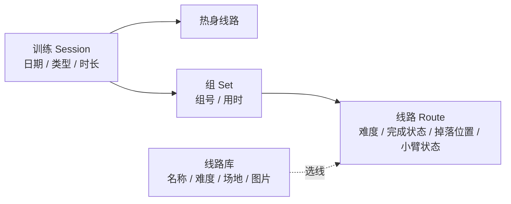

# 🧗 萝卜大法 · 攀岩训练记录

   

> 一个面向进阶攀岩者的移动端训练记录工具，用来记录"耐力泵感训练"的每一组、每一条线路，并追踪训练频率和线路完成度的变化。
>
> **名字由来**："萝卜大法"是一种攀岩耐力训练方法，要一直练到小臂像萝卜一样又胀又硬。

- 🌐 **在线体验**：https://climbing-training-log.vercel.app/ （建议用手机打开）
- 📄 **产品需求文档（PRD + MVP 定义 + 用户调研）**：[`docs/PRD.md`](docs/PRD.md)

## ⚡ 30 秒速览

| | |
| --- | --- |
| 我做了什么 | 独立完成**需求梳理 → PRD → 借助 Claude Code 开发 → 试用迭代 → 部署上线 → 用户调研**全流程 |
| 做到了什么程度 | v1 已上线：训练记录、线路库、历史编辑、统计、本地多账号 |
| 开发效率 | 集中开发约 **1 天**，近 **10 轮**核心迭代，单文件约 **1400 行**，**0** 个第三方依赖 |
| 产品思考 | 先定义要验证的假设（H1 / H2）和停止条件，再决定下一步做什么，而不是一直加功能 |

## 截图

> 截图用的是示例数据，线路名称均为虚构，不是真实使用记录。

| 首页 | 训练记录 | 选择线路 |
| --- | --- | --- |
|  |  |  |
| **历史详情** | **线路库** | **数据统计** |
|  |  |  |

---

## 为什么做这个

我自己在按"萝卜大法"练耐力：热身后连续爬 4–5 条难度递减的线路，直到小臂力竭，每次练 2 组，每周练 3 次。练的过程中有三个问题一直没解决：

1. **记不全**：每组爬了哪几条、每条完成了多少、在哪里掉的，练完就忘；
2. **看不出进步**：同一条线上次爬到 80%，这次完成了没有？只能凭感觉判断；
3. **频率失控**：一忙起来一周只练一次，超量恢复就断了。

市面上的记录工具（比如 theCrag）更适合野外线路"打卡"，不适合记录这种按组、按力竭程度的室内训练，所以我自己动手做了一个。

## 核心功能（v1，已上线）

| 模块 | 功能 |
| --- | --- |
| 🏠 首页 | 本周训练次数 / 周目标（3 次）、距上次训练天数、恢复提醒（本周不足 2 次、间隔超过 3 天时提示） |
| 📝 训练记录 | 分室内 / 野攀两种类型；记录热身线路；按组记录线路（YDS 难度 5.9–5.14d，完成 / 部分完成百分比 / 未完成及掉落位置），最后一条线记录小臂状态；组计时器（12 分钟变黄、15 分钟变红）；保存后停留在当前页并提示"保存成功" |
| 📚 线路库 | 保存常用线路（名称、难度、岩馆/区域、图片）；卡片式选线弹窗，可在弹窗内直接新增线路；图片在前端压缩后存储 |
| 🕘 历史记录 | 按日期倒序排列；可查看详情、编辑和删除；显示同一条线路"上次的完成情况" |
| 📊 数据统计 | 本月训练次数、最近 4 周训练频率图、各难度系列完成率、完成 2 次以上可以考虑升级的线路 |
| 👤 账号与数据 | 同一浏览器内多账号注册 / 登录 / 修改密码，数据按账号隔离；支持 JSON 导出 / 导入 |

## 技术实现

- **单文件应用**：`index.html`（约 1400 行），原生 HTML / CSS / JavaScript，不依赖任何框架和第三方库，手机浏览器直接打开就能用
- **数据存储**：浏览器 `localStorage`，每个账号的数据单独存一个 key
- **账号**：密码加盐后用 Web Crypto API 做 SHA-256 哈希再存储
- **图片**：用 Canvas 把图片缩放到最长边 400px，再逐步降低 JPEG 质量，转成 Base64 存储，防止超出 localStorage 容量
- **界面**：移动端优先；采用深色模式（岩馆光线暗）；按钮高度不低于 44px，方便单手操作
- **部署**：GitHub + Vercel

### 数据结构

我把训练方法拆成了"训练 → 组 → 线路"三层（完整字段见 [PRD 第 8 节](docs/PRD.md#8-数据模型)）：



## 快速开始

```bash
git clone https://github.com/yanu30000/climbing-training-log.git
cd climbing-training-log
# 不需要安装依赖，直接用浏览器打开 index.html 即可
open index.html        # macOS
start index.html       # Windows
```

## 用户调研：先验证需求，再决定做什么

我不想只做一个"自己觉得有用"的工具，所以给 MVP 定义了要验证的假设：

- **H1**：进阶攀岩者在做结构化训练时，愿意每次花不到 2 分钟记录，并且会回头看同一条线的完成度变化和训练频率；
- **H2**：比起凭记忆，看到数据后能更早判断"该换更难的线了"或"这周练少了"。

**访谈方法**：围绕"你现在怎么做"和"最近一次的具体情况"来提问，不问"你想要什么功能"；第一轮不提"我在做一个产品"，避免对方出于礼貌说好话。

**目前进展**：已联系 2–3 人，完整记录了 1 人的访谈。这位受访者野攀时会在 theCrag 打卡，室内训练不做记录，也很少回看历史记录。他觉得判断自己有没有变强确实难，但目前主要靠感觉找弱项。样本太少，还不能下结论，但这让我开始考虑：**"帮我找弱项"可能比"看进步曲线"更接近真实需求**。

**判断规则**：如果 3 位以上核心用户都表示"不需要回看进步"，就停止做进步分析这个方向。详见 [PRD 第 4、6 节](docs/PRD.md#4-用户调研)。

## ⚠️ 当前局限（如实说明）

- **数据只存在当前浏览器**：换设备、清缓存后数据无法找回（建议定期导出 JSON 备份）；
- **"多账号"是本地账号**：只在同一个浏览器里隔离数据，不是互联网账号，也没法找回密码；
- **升级提示逻辑与需求不一致**：需求要求"连续 2 次完成"才提示升级，代码实际统计的是"累计 2 次"，待修复；
- **没有使用数据埋点**：暂时无法衡量 H1，已列为 MVP 的 P1 功能；
- **应用内没有 AI 功能**：AI 只用在开发过程中，产品本身不调用大模型；
- **还没有经过真实用户验证**：目前外部试用用户为 0，只有我自己在用。

## 开发过程：用 AI 做产品

这个项目的开发方式是**我写需求、Claude Code 写代码、我验收迭代**。我的主要工作，是把模糊的想法变成 AI 能执行的需求文档：

1. **v0 需求说明**：把训练方法拆成数据结构，明确功能优先级（必须做 / 加分项）、界面要求和技术限制，生成第一版单文件应用；
2. **自己试用后提出 4 条改进**：线路库添加后马上刷新、线路图片 + 卡片式选线、保存后停留在当前页、历史记录可编辑；同时规定了开发顺序和图片压缩标准（单张 ≤100KB）；
3. **多账号**：在本地实现注册登录和按账号隔离数据，并兼容迁移旧数据；
4. **下一步（规划中）**：云端账号 + 跨设备同步，选型方案已经写好，还没开始开发。

**解决的关键问题**

- **线路库和训练记录数据不同步**（核心问题）：添加线路后列表不刷新，训练时也选不到已保存的线路。我把线路库改成唯一数据源，每次修改后统一执行"保存 → 重新渲染"，并把选线改成卡片弹窗（可以直接新增线路），打通了两个流程。
- **iOS 上日期输入框撑破卡片**：移动端浏览器会给日期输入框加默认最小宽度。我通过设置 `min-width:0` 并去掉系统默认外观解决了这个问题。

**一条经验**：AI 曾参考一张截图，自己多加了一个"组间休息倒计时"，但这不在当时的优先级里，我让它删掉了。**交给 AI 的需求要有明确的范围和验收标准，否则它会"多做"。**

更多复盘见 [PRD 第 12 节](docs/PRD.md#12-附录ai-辅助开发工作流)。

## Roadmap

- [x] v1：训练记录、线路库、历史编辑、统计、本地多账号、部署上线
- [ ] v1.0.1：修复"连续 / 累计完成"的升级提示逻辑
- [ ] v1.1：云端账号与跨设备同步（Supabase / Firebase 选型中），支持一键上传本地数据
- [ ] 用户调研：访谈 3–5 位不同类型的攀岩者，验证 H1 / H2
- [ ] v2（**要等调研结果决定做不做**）：更通用的记录方式、进步趋势可视化、基于数据的训练建议

## 作者

**殷继源**（jiyuan）· 北京信息科技大学 智能制造工程 · 攀岩爱好者（户外红点 5.12b）

📮 联系方式：[hiyinjiyuan@gmail.com](mailto:hiyinjiyuan@gmail.com)

## License

[MIT](LICENSE)
